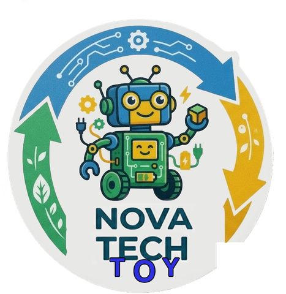

# Nova Tech Toy

Site institucional da **Nova Tech Toy**, uma iniciativa que transforma resíduos eletrônicos em experiências tecnológicas, sustentáveis e inclusivas para a infância.



## Sobre a Nova Tech Toy

A Nova Tech Toy nasce da ideia de ressignificar resíduos eletrônicos, transformando-os em brinquedos sustentáveis e sensoriais que conectam tecnologia, aprendizado e inclusão. O projeto une **Design Universal**, **economia circular** e **inovação** para criar experiências de brincar que incluem crianças neurotípicas e neurodivergentes através de uma proposta verdadeiramente universal.

## Objetivo do site

Apresentar a identidade, a missão, a visão, os valores e o impacto da Nova Tech Toy de forma institucional e profissional — **sem** características de loja virtual (sem carrinho, checkout, preços ou catálogo comercial). O foco está em comunicar propósito, credibilidade e identidade de marca, deixando a proposta social evidente através do conteúdo, e não de afirmações repetitivas.

## Tecnologias utilizadas

Site 100% estático, construído sem frameworks ou dependências de build:

- **HTML5** semântico
- **CSS3** (Custom Properties, Flexbox, Grid, media queries, animações)
- **JavaScript** puro (Vanilla JS — sem bibliotecas externas)

Não há backend, banco de dados ou etapa de build. O projeto funciona apenas abrindo o `index.html` ou hospedando os arquivos em qualquer servidor estático.

### Estrutura do projeto

```
nova-tech-toy/
│
├── index.html
│
├── css/
│   └── style.css
│
├── js/
│   └── script.js
│
├── assets/
│   ├── logo.png              → marca (ícone) usada no header e no footer
│   ├── imagens/
│   │   └── nova-tech-toy-selo.png   → selo completo, usado na seção inicial
│   └── icons/
│       ├── favicon-32.png
│       └── apple-touch-icon.png
│
└── README.md
```

Todos os caminhos usados no projeto são **relativos**, sem qualquer dependência de diretórios locais.

## Como executar localmente

Não é necessário instalar nada. Basta abrir o arquivo `index.html` diretamente no navegador, ou, para simular um servidor (recomendado, evita eventuais bloqueios de segurança do navegador para arquivos locais):

```bash
# Python 3
python -m http.server 8000

# ou, com Node.js instalado
npx serve .
```

Depois acesse `http://localhost:8000` no navegador.

## Como publicar no GitHub Pages

1. Crie um repositório no GitHub e envie os arquivos do projeto:

   ```bash
   git init
   git add .
   git commit -m "Primeira versão do site institucional Nova Tech Toy"
   git branch -M main
   git remote add origin https://github.com/SEU-USUARIO/SEU-REPOSITORIO.git
   git push -u origin main
   ```

2. No GitHub, acesse **Settings → Pages**.
3. Em **Source**, selecione a branch `main` e a pasta `/root`.
4. Salve. Em alguns minutos o site estará disponível em:

   ```
   https://SEU-USUARIO.github.io/SEU-REPOSITORIO/
   ```

Como o projeto é 100% estático e usa apenas caminhos relativos, nenhuma configuração adicional é necessária.

## Personalização

- **Cores da marca**: todas as cores estão centralizadas em `:root` no topo de `css/style.css` (`--primary`, `--secondary`, `--accent`, `--magenta`, `--dark`, `--paper`), extraídas da identidade visual oficial da marca.
- **Números da seção Impacto**: são valores ilustrativos e editáveis. Para alterá-los, edite os atributos `data-target` e `data-suffix` de cada `<dd class="impact-value">` em `index.html`.
- **Links de contato/Instagram**: os links no rodapé (`mailto:` e Instagram) são placeholders — atualize-os em `index.html` com os dados reais da iniciativa.

## Acessibilidade e performance

- HTML semântico com hierarquia de headings coerente e landmarks (`header`, `main`, `nav`, `footer`).
- Textos alternativos em todas as imagens, estados de foco visíveis e navegação completa por teclado.
- Suporte a `prefers-reduced-motion` para usuários sensíveis a animações.
- Sem dependências pesadas: apenas uma fonte web (Google Fonts) e imagens otimizadas — carregamento leve mesmo em conexões mais lentas.

---

Projeto institucional desenvolvido com fins educacionais, unindo tecnologia, sustentabilidade e inclusão.
